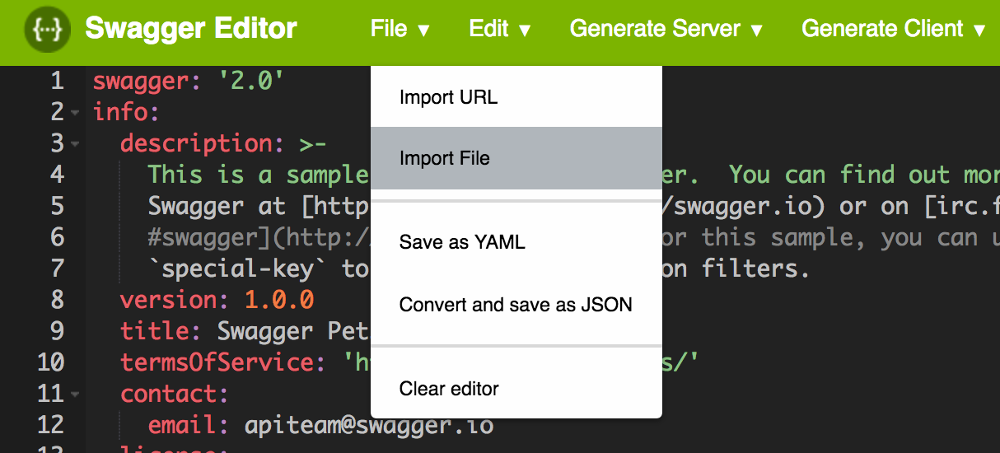
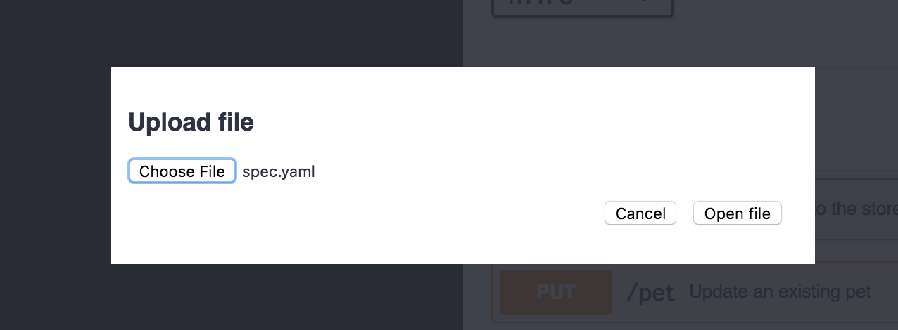
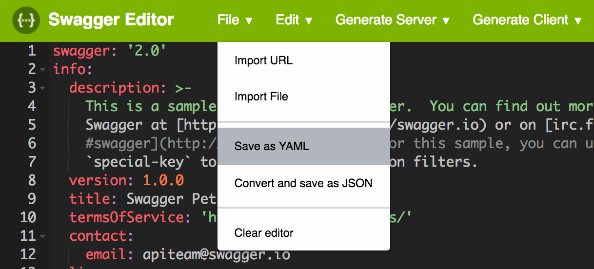

# swagger-mock-api

## Prerequisites

- [Docker](https://www.docker.com/)
  - [Docker for Mac](https://www.docker.com/docker-mac)

## Getting Started

### Build

```bash
git clone --depth=1 https://github.com/locol23/swagger-mock-api
cd swagger-mock-api
docker build -t mock .
```

### Run

```bash
docker run -p 8080:8080 -d mock
```

Go to http://localhost:8080/docs/

### Stop

```bash
docker kill $(docker ps -q)
```

## How to edit API spec

### Open Online Swagger Editor

Go to [Online Swagger Editor](https://editor.swagger.io/)

### Import File

import and upload your API spec file


※ Concerning security, you can copy & paste your API spec

### Edit

edit your API spec

### Save File

save your API spec


